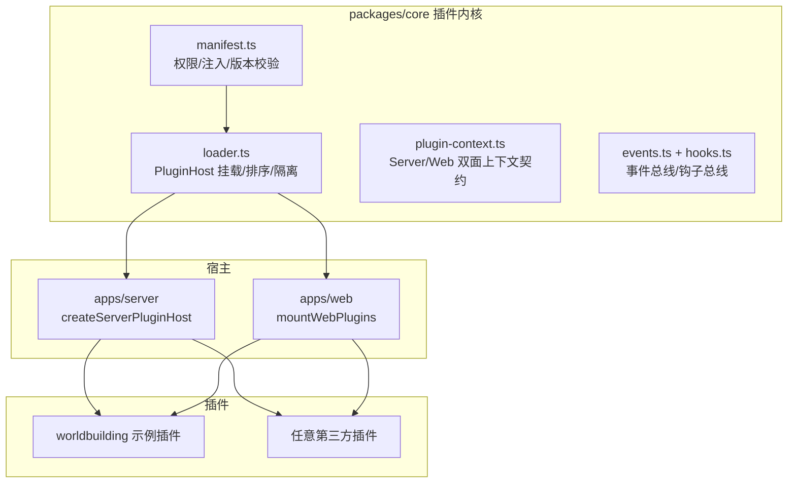

# NovelMuse 插件化开发指南

> F:\new1.2 采用 DeepSeek Harness 风格的插件模块化架构。本文档说明如何添加、开发、验证插件。
> **安装/挂载必须遵守的标准见 [`docs/plugin-standard.md`](./plugin-standard.md)（novel-plugin-standard/1.0）。**
> 核心内核：`packages/core`（零业务依赖，仅 zod）；宿主：`apps/server`（Server 面）、`apps/web`（Web 面）。

## 1. 架构总览



- **插件 = 双面模块**：`exports "."`（Server 面，Node 运行）+ `exports "./web"`（Web 面，浏览器运行）。
- **注册 = 契约调用**：插件 `apply(ctx)` 内调用 `ctx.routes.register` / `ctx.ai.tools.register` / `ctx.registerProjectPanel` 等，宿主自动聚合渲染。
- **失败隔离**：单个插件校验失败 / apply 抛错只记录日志并跳过，不影响宿主与其他插件。

## 2. 快速开始：新建一个插件

### 2.1 目录结构（workspace 包）

```
apps/plugins/my-plugin/
├── package.json            # name: @novel-plugins/my-plugin
└── src/
    ├── server/index.ts     # Server 面（exports "."）
    └── web/index.tsx       # Web 面（exports "./web"）
```

`package.json` 关键字段：

```jsonc
{
  "name": "@novel-plugins/my-plugin",
  "main": "src/server/index.ts",           // tsx 直接跑 TS 源码
  "exports": {
    ".":      { "import": "./src/server/index.ts", "types": "./src/server/index.ts" },
    "./web":  { "import": "./src/web/index.tsx",   "types": "./src/web/index.tsx" }
  },
  "novelMuse": {                            // 插件清单（manifest）
    "id": "novel.my-plugin",                // 必须 a.b.c 三段式
    "name": "我的插件",
    "description": "…",
    "version": "0.1.0",
    "permissions": ["routes", "db:project", "ai:tools", "events"],
    "server": { "inject": ["routes", "db", "ai", "events"] },
    "web":    { "inject": ["projectPanels", "commands"] }
  },
  "dependencies": { "@novel/core": "workspace:*", "hono": "^4.12.25" }
}
```

### 2.2 Server 面

```ts
import { Hono } from 'hono';
import type { ServerPluginContext } from '@novel/core';

export const name = 'novel.my-plugin';
export const inject = ['routes', 'db'];

export function apply(ctx: ServerPluginContext): void {
  // ① 路由（Hono 子路由，前缀由宿主挂载）
  const router = new Hono();
  router.get('/', (c) => c.json({ hello: 'world' }));
  ctx.effect(() => ctx.routes.register('/api/plugins/my-plugin', router));

  // ② AI 工具（自动继承项目隔离）
  ctx.ai.tools.register(
    { type: 'function', function: { name: 'my_tool', description: '…', parameters: {} } },
    async (args, toolCtx) => ({ success: true, result: 'ok' }),
  );

  // ③ 插件 KV（主库/项目库双作用域，自动建表，无需迁移）
  await ctx.db.kv.set('my-plugin', 'settings.theme', { color: 'blue' }, { projectId: toolCtx.projectId });

  // ④ 事件订阅
  ctx.events.on('chapter.saved', async ({ projectId }) => { /* … */ });

  // ⑤ AI 技能（name/description/color 会经 GET /api/ai/skills 下发到前端技能选择器，
  //    前端无需任何改动；未提供展示元数据时名称回退为 id）
  ctx.ai.skills.register({
    id: 'my-advisor',
    name: '我的顾问',
    description: '一句话描述',
    color: '#4F918C',
    systemPrompt: '【已激活技能：我的顾问】…',
    contextKeys: [],
  });
}
```

### 2.3 Web 面

```tsx
import React from 'react';
import { Sparkles } from 'lucide-react';
import type { WebPluginContext } from '@novel/core';

export const name = 'novel.my-plugin';

export function apply(ctx: WebPluginContext): void {
  // ① 项目工作台浮窗面板（插件主功能 UI 入口，自动出现在面板栏）
  //    scope: 'workspace'（缺省）进顶栏按钮组；'editor' 进编辑器右侧面板栏
  //    （scope:'editor' 的面板组件可经 useEditorStore 读取编辑器实例）
  ctx.registerProjectPanel({ key: 'my-panel', label: '我的面板', icon: Sparkles, Component: MyPanel, width: 480, height: 640 });

  // ② Ctrl+K 命令
  ctx.registerCommand({ id: 'my-plugin.doSomething', title: '做某事', keywords: ['xx'], run: () => { /* … */ } });

  // ③ 顶级路由（可选用）
  ctx.registerRoute({ path: '/my-plugin', Component: MyPage, guard: 'protected' });

  // ④ 设置页区块（默认挂在「插件」栏目，category 可选 general/ai/security/plugins/updates）
  ctx.registerSettingsSection({ key: 'my.settings', title: '我的设置', icon: Sparkles, category: 'general', Component: MySettings });

  // ⑤ 编辑器 Tiptap 扩展（工厂函数，每个编辑器实例 create 一次）
  ctx.registerEditorExtension({ key: 'my.ext', create: () => MyExtension });

  // ⑥ 编辑器工具栏按钮（正文上方；isActive 可选，用于激活态高亮）
  ctx.registerEditorToolbarItem({ key: 'my.btn', label: '做某事', icon: Sparkles, run: (editor) => { /* … */ } });

  // ⑦ 选区菜单动作（选中正文文字后浮出菜单追加一项）
  ctx.registerSelectionAction({ key: 'my.act', label: '做某事', icon: Sparkles, run: ({ text, editor }) => { /* … */ } });
}
```

> **扩展点白名单**：`plugin.json` / manifest 里 `web.inject` 可声明的值必须与上面的
> register\* 一一对应（`routes / projectPanels / commands / settings / editor / toolbar / selection / api`），
> 见 `packages/core/src/manifest.ts` 的 `WEB_SERVICES`——声明了未实现的扩展点会被校验拒绝。
>
> **注意**：插件 Web 面是 vite 构建期收集（`main.tsx` 静态清单 + `import.meta.glob` 本地扫描），
> 新增插件文件后需重启 vite dev / 重新构建；server 侧插件的运行时启停不会摘除已注册的 Web 面 UI。
> 所有条目注册进 Zustand 注册表（`apps/web/src/plugin/registry.ts`），卸载函数可安全调用（不会误删其他插件条目）。

## 3. 挂载插件（唯一需要改宿主的地方）

> 挂载登记集中在两个清单文件，新增插件只加一行，**不修改任何业务代码**。

### Server 面：`apps/server/src/plugin/builtin.ts`

```ts
moduleEntry('novel.my-plugin', { id: 'novel.my-plugin', name: '我的插件', permissions: ['routes'] },
  () => import('@novel-plugins/my-plugin')),
```

### Web 面：`apps/web/src/main.tsx`

```ts
void mountWebPlugins([
  { id: 'novel.builtin-panels', load: async () => builtinPanelsPlugin },
  { id: 'novel.my-plugin', load: () => import('@novel-plugins/my-plugin/web') },
]);
```

## 4. 验证

```bash
pnpm install --offline            # 建立 workspace 链接
pnpm --filter @novel/server type-check
pnpm --filter @novel/web type-check
pnpm --filter @novel/server dev   # → http://localhost:3774（/api/health 里 plugins 数组显示新插件）
pnpm --filter @novel/web build    # 插件 Web 面进入 bundle
```

## 5. 权限与安全约束

| 权限 | 能力 | 说明 |
| --- | --- | --- |
| `routes` | 注册 Hono 路由 | 卸载需重启（Hono 无 unroute） |
| `db:global` / `db:project` | 主库 / 项目库访问 | 项目库按 projectId 隔离 |
| `ai:tools` | 注册 AI 工具 | 工具上下文注入 projectId，禁止删除类工具 |
| `ai:skills` / `ai:agents` / `ai:providers` | 技能 / 智能体 / 模型提供商 | 系统提示组装时读取 |
| `events` | 事件总线订阅 | `chapter.saved` 等 |
| `settings` / `scheduler` / `prompt` | 设置页 / 定时任务 / 提示词段 | 定时任务 unref，不阻塞退出 |

## 6. 示例插件：worldbuilding（世界观建造师）

`apps/plugins/worldbuilding/` 展示了完整契约：
- Server：`/api/plugins/worldbuilding` 势力 CRUD（KV 存储）+ 2 个 AI 工具（create_faction / list_factions）+「世界观顾问」技能 + 章节保存事件自动累计势力出场。
- Web：项目面板「势力」（列表 + 新增）+ 命令「新增势力」。

```bash
# 冒烟测试（登录后）
curl -X POST http://localhost:3774/api/plugins/worldbuilding \
  -H "Authorization: Bearer <token>" -H "X-Project-Id: <projectId>" \
  -H "Content-Type: application/json" -d '{"name":"天穹议会","alignment":"正派"}'
```

## 7. 插件管理（设置 → 插件栏目）

设置页「插件」栏目提供完整的管理能力（需要管理员登录）：

| 能力 | 说明 |
| --- | --- |
| 插件列表 | 全部插件（当前 22 个：19 路由内置 + worldbuilding + plugin-manager + 本地 typography）的名称/ID/状态/权限/依赖/被依赖/来源（builtin/local/npm） |
| 运行时开关 | 启用 = 重新 apply；禁用 = 逆序清理 disposers（AI 工具/技能/事件/定时任务/KV 即时生效） |
| 状态持久化 | 禁用清单存主库 `plugin_kv`（`novel.host:disabled-plugins`），重启后仍保持禁用 |
| 依赖保护 | 依赖的插件未启用时，启用被拒（HTTP 409 DEPENDENCY_UNMET）；禁用前提示受影响的依赖方 |
| 全局依赖检查 | `GET /api/admin/plugins/deps` 返回互相依赖图 + 缺失依赖 + 循环依赖警告 |

**已知限制（Hono 架构性）**：路由注册后无法 unroute、matcher 构建后无法新增路由。因此：
- 禁用插件后，其路由在**重启后**才真正失效（扩展点已即时清理）
- 首次启用（本进程内未注册过路由）时路由可能需重启生效，插件其余扩展点立即恢复

管理端接口（均需 requireAuth + requireAdmin）：
```text
GET   /api/admin/plugins                # 列表 + 依赖分析 + 守护策略
GET   /api/admin/plugins/deps           # 全局依赖分析
POST  /api/admin/plugins/:id/enable     # 启用（校验依赖）
POST  /api/admin/plugins/:id/disable    # 禁用（返回受影响的依赖方）
POST  /api/admin/plugins/:id/promote        # 守护器：手动放行（跳过剩余隔离期）
POST  /api/admin/plugins/:id/re-quarantine  # 守护器：重置回隔离箱（被熔断禁用的会同时重新挂载启用）
```

### 7.1 插件守护器与隔离箱

非内置插件（`source: local / npm`，含 AI 创建的插件）默认进入**隔离箱**试运行；内置 19+2 模块信任不隔离。守护器对插件运行期错误（路由请求 / AI 工具 / 事件回调 / 定时任务）**按插件归因计数**：

```text
挂载 → quarantined（隔离中）
  ├─ 隔离期累计错误 ≥ errorThreshold(默认 3) → 自动熔断禁用 + 标记 failed
  ├─ 连续 promoteAfterSessions(默认 2) 个完整会话 0 错误 → 自动放行（trusted，持久化）
  ├─ 管理员手动 → 立即放行 / 重新隔离（设置页按钮或上方两个 POST 接口）
  └─ failed 插件被重新启用 → 自动重置回 quarantined 重新观察
```

- 「无误」判定 = 连续 2 个完整服务会话（每次启动/重挂算一个会话）隔离期零错误；从未出错即放行，出错即重新计会话
- 已放行（trusted）插件的错误仍计数展示，但不再熔断（防误伤生产）；设置页可随时手动重新隔离
- 状态持久化在主库 `plugin_kv`（`novel.host:guardian`）；调用次数（invocations）仅内存展示，重启清零
- 阈值可用环境变量覆盖：`NOVEL_GUARDIAN_SESSIONS`（放行会话数）、`NOVEL_GUARDIAN_ERRORS`（熔断错误数）
- 设置页「插件」栏目展示守护徽章（隔离中/已放行/已熔断）+ 会话/错误/调用统计 + 最近错误

**边界（诚实声明）**：插件与宿主同进程，守护器提供的是「观测 + 归因 + 熔断止损 + 可见性」，不是内存级沙箱——不承诺拦截插件对 `ctx.db` 的直接写入（仅审计计数）。前端另有面板级渲染边界：任何面板组件抛错只隔离在本面板内（显示重试入口），不再崩掉整个应用。

## 8. AI 对话创建插件

在项目工作台的 AI 对话面板中**开启「工具调用」**后，直接对 AI 说：
> 「创建一个 xxx 插件，功能是……」「建一个世界观插件」「添加一个物品管理插件」

AI 会调用内置工具 `create_plugin` / `list_local_plugins` 完成：

| 步骤 | 机制 |
| --- | --- |
| 1. 生成代码 | AI 传入语义化参数（id/name/描述/权限/依赖），缺省 serverCode/webCode 时用通用模板（KV CRUD 路由 + 项目面板 + AI 工具 + 事件订阅） |
| 2. 落盘 | 写入 `apps/plugins/local/{shortId}/`（plugin.json + server/index.ts + web/index.tsx）——**无需修改任何宿主文件** |
| 3. 运行时挂载 | 非路由扩展点（AI 工具/事件/面板/设置）立即生效；新增路由需重启 server 完全生效（Hono 限制） |
| 4. 持久加载 | server 重启自动扫描 `apps/plugins/local/`；web 面由 vite `import.meta.glob` 构建期收集（重启 vite dev 后出现面板） |

安全约束：id 自动归一化（`novel.test-items` → `novel.testitems`）、禁止目录穿越、插件运行在宿主沙箱（apply 失败只禁用自身）。

```bash
# 手动删除插件（等价于卸载）
rm -rf apps/plugins/local/{shortId}   # 重启 server 后移除
```

## 9. 与 DeepSeek Harness 插件模型的对比

| 维度 | DSH（cordis） | NovelMuse |
| --- | --- | --- |
| 内核 | cordis framework | `packages/core`（自研，仅 zod 依赖） |
| 上下文 | `apply(ctx)` + `inject` | `apply(ctx)` + `inject`（同构） |
| 生命周期 | `ctx.effect(() => disposer)` | `ctx.effect(() => disposer)`（同构） |
| 双面插件 | `exports "."` + `exports "./client"` | `exports "."` + `exports "./web"`（同构） |
| 清单 | package.json `dsh` 字段 | package.json `novelMuse` 字段（同构） |
| 动态热插拔 | `~/.dsh/cordis.patch.yml` + 符号链接 | 构建期清单（CSP 限制运行时远程加载） |
| 失败隔离 | 单插件错误不崩溃宿主 | 同（log + skip） |
